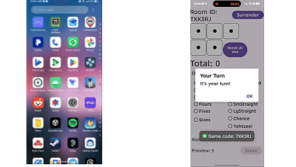
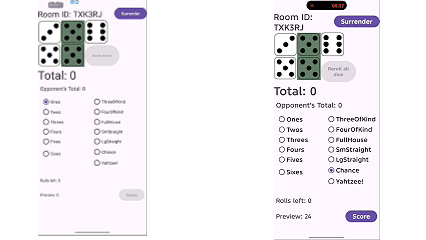

# Multiplayer Yahtzee (Android)
A solo University project of the game Yahtzee focusing on database management to deliver a multiplayer experience between two devices.

**Platform:** Android  
**Language:** Java  
**Multiplayer:** Firebase Realtime Database (room-based sync) + Firebase Anonymous Auth  
**Repo Type:** Portfolio showcase (curated code snippets + demos)

---

## Overview
A turn-based **multiplayer Yahtzee** app for Android. Players can host a room, share a room code, connect to the same match, and play a full Yahtzee game with synchronized turns, dice state, and scoring updates in real time.

---

## Features
- **Host / Join Room Flow** using a generated room code *(see demo1.gif)*
- **Turn-based Multiplayer Sync**: current player turn, dice state, and score state update for all players
- **Yahtzee Rules + Scoring Engine**: validates scoring categories and calculates points
- **Real-time UI Updates** driven by shared game state (dice, categories, scoreboard)
- **Disconnect-safe architecture** (state stored centrally in Firebase so clients can resync)

---

## Demo
### 1) Hosting & Connecting
Shows creating a room and connecting another player via room code:  
`media/demo1.gif`

### 2) Gameplay
Shows turn flow, rolling dice, selecting categories, and score updates:  
`media/demo2.gif`

---

## Architecture (High Level)
This project uses a **shared game state** model stored in Firebase. Clients:
1. Join a room (gameId)
2. Subscribe to updates (ValueEventListener)
3. Render UI from the latest `GameState`
4. Submit user actions by updating the shared state (dice roll, scoring choice, pass turn)

This makes multiplayer deterministic and easy to reason about: **the database is the source of truth**, and the UI is derived from state.

---

## Code Highlights
> These files demonstrate the core engineering work: matchmaking flow, shared state design, real-time sync, and scoring logic.

### Lobby / Room Hosting & Joining

### Multiplayer State Models (Shared State)

### Real-time Sync + Turn Handling

### Yahtzee Scoring Engine

---

## Suggested “Showcase Snippets” (for a public portfolio repo)
If you're keeping the full project private, include only curated snippets:

**/code-snippets/**

This keeps the repo clean, readable, and focused on your strongest engineering work.

---

## What I Learned / Engineering Focus
- Designing a multiplayer system around a **single source of truth** game state
- Building **turn-based synchronization** that stays consistent across clients
- Implementing a rules engine (Yahtzee scoring) and keeping it reliable
- Structuring code so UI is driven by state, which simplifies debugging

---

## Notes
This repository is intended as a **portfolio showcase**. Full project code and build are available upon request. Please email me at sothearnithsreng@gmail.com